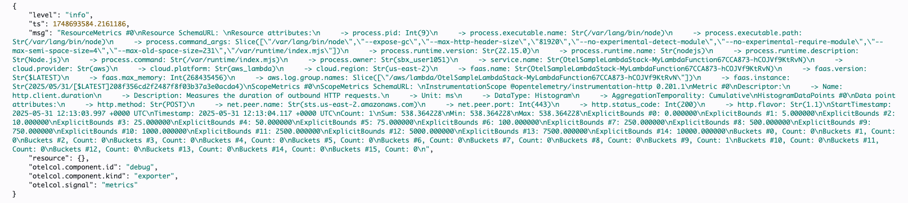

# 🧪 AWS SDK Sample Application with OpenTelemetry

This sample demonstrates how to use the **AWS SDK** within a Lambda function with **OpenTelemetry (OTel)** capabilities. It performs a simple `STS GetCallerIdentity` call for demonstration purposes and outputs Otel telemetry data to logs.

Example log output:  


---

## 🚀 Deploy Using AWS CDK

Follow these steps to deploy the demo stack via CDK:

1. **Install dependencies**  
   `npm install`

2. **Bootstrap your AWS environment (if not done already)**  
   `npx cdk bootstrap`

3. **Deploy the stack**  
   `npx cdk deploy OtelSampleLambdaStack`

---

## 🚀 Deploy Using Terraform

Follow these steps to deploy the demo stack via Terraform:

1. **Install dependencies**
   `npm install`

2. **Build the Lambda function artifact**
   `npm run build`

3. **Move to deploy/wrapper folder**
   `cd deploy/wrapper`

4. **Terraform init**
   `terraform init`

5. **Terraform apply**
   `terraform apply`

---

## 🛠️ Manual Deployment via AWS Console

If you'd prefer to deploy manually:

1. **Install dependencies**  
   `npm install`

2. **Build the Lambda function artifact**  
   `npm run build`

3. **Create a new AWS Lambda function**  
   - Runtime: Select the latest `nodejs.x`

4. **Upload the artifact**  
   - File location: `build/function.zip`

5. **Set the following environment variables**
```
   OTEL_EXPORTER_OTLP_ENDPOINT=http://localhost:4318/  
   OTEL_TRACES_EXPORTER=console
   OTEL_METRICS_EXPORTER=console
   OTEL_LOG_LEVEL=INFO
   OTEL_TRACES_SAMPLER=always_on
   AWS_LAMBDA_EXEC_WRAPPER=/opt/otel-handler
```
6. **Attach the Node.js instrumentation layer**  
   - Refer to the latest ARN in the OpenTelemetry Lambda releases, ie:  
     https://github.com/open-telemetry/opentelemetry-lambda/releases/tag/layer-nodejs%2F0.14.0

7. **Attach the OpenTelemetry Collector layer**  
   - Refer to the ARN in the release notes, ie:  
     https://github.com/open-telemetry/opentelemetry-lambda/releases/tag/layer-collector%2F0.15.0